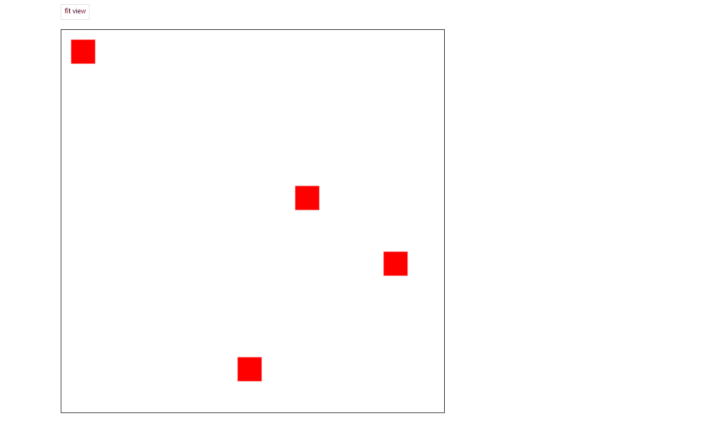

# fabric-fitview

A Fabric.js library that makes objects adapt to the canvas and keeps all objects within the viewport of the canvas.



# Usage

```bash
yarn add fabric-fitview
```

```javascript
import { fitView } from 'fabric-fitview';

fitView(canvas, options);
```

The following configuration options are supported:

```js
interface FitViewOptions {
    padding?: {
        left: number;
        right: number;
        top: number;
        bottom: number;
    };
    maxZoom?: number;
    minZoom?: number;
}
```

# Examples

```js
import { fitView } from 'fabric-fitview';

const canvas = new fabric.Canvas('canvas');

// Add objects to the canvas

// Fit all objects within the viewport of the canvas
fitView(canvas, {
    padding: {
        left: 100,
        height: 100,
        top: 100,
        bottom: 100,
    }
});
```